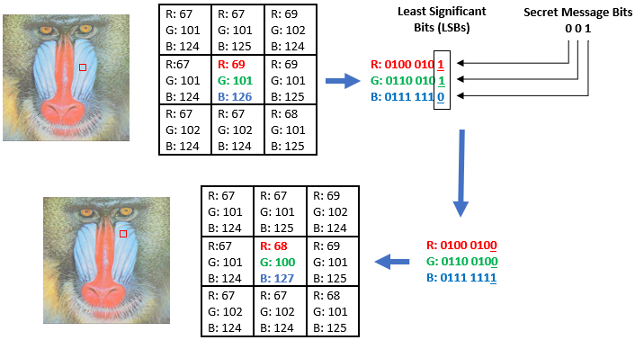
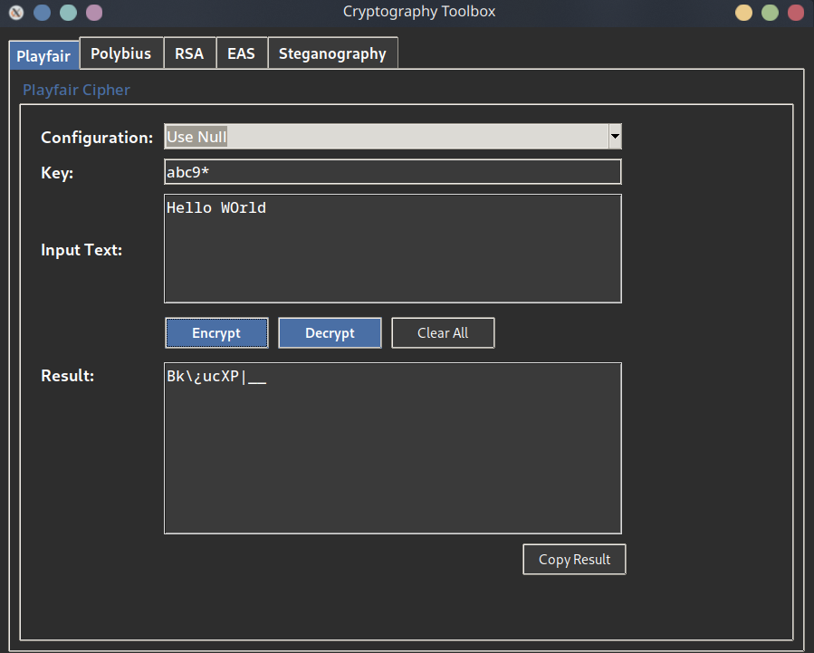
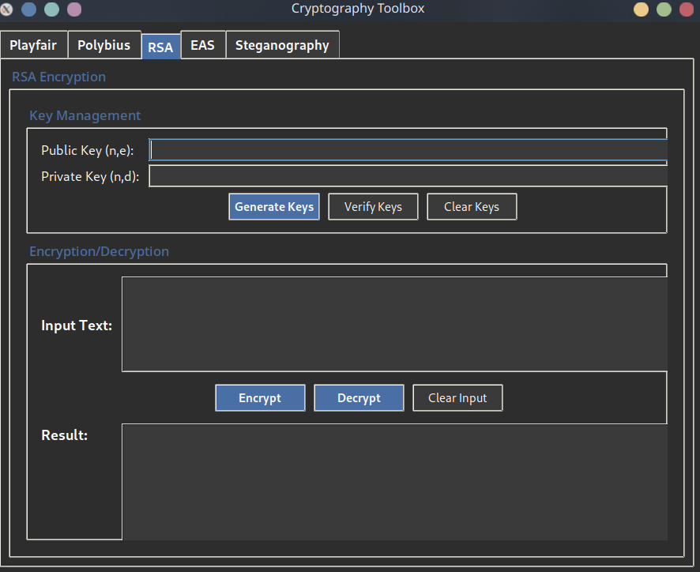
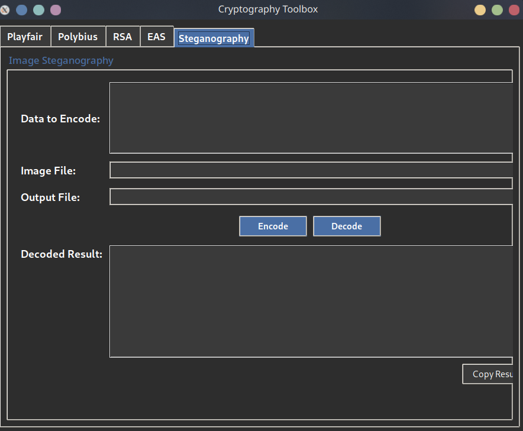

# Cryptography Project – Report

## Project Setup

### Installation

* **Clone via Git:**

  ```bash
  git clone https://github.com/B-AJ-Amar/cryptography-project.git
  ```

* **Or download the `.zip` file:**

  

### Run the GUI

```bash
cd src
python main.py
```

### Run Unit Tests

```bash
cd src
pytest
```

---

## Introduction

This project explores classical and modern cryptographic techniques through a modular Python-based framework. By implementing ciphers like Playfair, Polybius, and RSA, as well as AES S-boxes and LSB-based steganography, the project demonstrates both theoretical and practical aspects of secure communication. Each algorithm is encapsulated in configurable, reusable components, with a graphical user interface (GUI) built using Tkinter, making the project user-friendly. Additionally, the inclusion of a testing suite ensures reliability. This project is designed for educational purposes, making cryptography accessible and engaging for experimentation.

---

## Architecture Overview

### Base Cryptographic Classes (`base.py`)

Defines a unified structure for cryptographic implementations:

* **`Crypto` (Abstract Base Class):**

  * Defines `encrypt()` and `decrypt()` as required methods.
  * Enforced via Python’s `ABC` module.

* **`SymmetricCrypto`:**

  * For classical ciphers like Playfair and Polybius.
  * Includes built-in key handling (`get_key()`, `set_key()`).

* **`AsymmetricCrypto`:**

  * For key-pair systems like RSA.
  * Automatically generates keys when not provided.

---

## Playfair Cipher

**Files**: `playfair_cipher.py`, `playfair_conf.py`

### Features

* **Three Modes**:

  1. `Classic`: 5×5 grid (I/J merged) — historical accuracy.
  2. `UseNull`: 16×12 grid — full ASCII with NULL-byte padding.
  3. `NoNull`: 19×10 grid — printable ASCII only.

* **Separation of Concerns**:

  * `playfair_conf.py`: Defines character sets, padding rules, and grid logic.
  * `playfair_cipher.py`: Executes encryption/decryption.

### Security & Design

* Padding: Automatic (NULL/²) for odd-length inputs.
* Deduplication: Customizable character substitution.
* Grid logic prevents edge-wrapping and maintains key order.

### Benefits

* Historical compatibility (Classic).
* Binary & text data support (UseNull, NoNull).
* Easy mode updates via configuration changes.

---

## Polybius Square Cipher

**Files**: `polybius_square_cipher.py`, `polybius_square_conf.py`

### Features

* **Three Modes**:

  1. `Classic`: 5×5 grid (I/J merged).
  2. `UseNull`: 16×12 grid for full ASCII (incl. control chars).
  3. `NoNull`: 19×10 grid — printable ASCII only.

* **Config-Driven Design**:

  * `polybius_square_conf.py`: Character sets and grid layout.
  * `polybius_square_cipher.py`: Encodes/decodes via coordinates.

### Security & Design

* Grid is key-first, then auto-filled.
* Classic filters non-alphabetic characters.
* Extended modes support case, special characters, and missing data handling.

### Benefits

* Historical fidelity.
* Modern data (text, binary) compatibility.
* Config-only updates for new modes.

---

## Configuration Framework

### Strategy Pattern Implementation

This framework leverages the Strategy Pattern to decouple cryptographic logic from configuration details, enabling flexible runtime customization.

### Features

* **Config Classes**:
  * Encapsulate character sets, padding rules, and grid layouts.
  * Allow seamless updates without modifying core cryptographic logic.

* **Dynamic Algorithm Customization**:
  * Supports runtime switching of configurations.
  * Simplifies experimentation with different modes.

### Benefits

* **Single-Responsibility Principle**:
  * Keeps cryptographic logic focused on encryption/decryption.
  * Delegates character handling and grid management to configuration classes.

* **Extensibility**:
  * Adding new configurations requires minimal changes.
  * Promotes modularity and reusability.

### Implementation Example

* **Playfair Cipher**:
  * `playfair_conf.py`: Defines grid logic and character sets.
  * `playfair_cipher.py`: Operates based on the provided configuration.

* **Polybius Square Cipher**:
  * `polybius_square_conf.py`: Manages grid layout and character mappings.
  * `polybius_square_cipher.py`: Encodes/decodes using the configuration.

This approach ensures a clean separation of concerns, making the framework adaptable and maintainable for future enhancements.

---

## RSA Public-Key Cipher

**File**: `rsa_cipher.py`

### Features

* 2048-bit minimum key size.
* UTF-8 support.
* Automatic key generation.

### Key Innovations

1. **Message Chunking**:

   * Auto-calculates max chunk size with `_calculate_max_chunk_size()`.
   * Prevents overflow of modulus size.

2. **Prime Generation**:

   * Small prime pre-check + Miller-Rabin (5 iterations).
   * High accuracy and performance.

3. **Key Validation**:

   * Ensures: `n ≥ 2048 bits`, `e = 65537`, and valid modular inverse for `d`.

### Security Decisions

| Choice             | Reason                        | Implemented In   |
| ------------------ | ----------------------------- | ---------------- |
| `e = 65537`        | Security/performance tradeoff | `generate_key()` |
| Miller-Rabin `k=5` | Probabilistic prime checking  | `_is_prime()`    |

### Implementation Notes

* Key format: `n,e` or `n,d` (comma-separated integers).
* Message flow: UTF-8 → bytes → int chunks → RSA.
* Errors: Handles key format and message size issues gracefully.

---
## AES Substitution Boxes (`aes.py`)

### Features

* **Core AES Structure**:
  * Implements NIST-standard AES (originally Rijndael).
  * Fixed 128-bit block size.
  * Three key size options:
    1. **128-bit**: 10 rounds.
    2. **192-bit**: 12 rounds.
    3. **256-bit**: 14 rounds.
  * Four fundamental transformations:
    1. `SubBytes`: Non-linear byte substitution using a predefined S-box.
    2. `ShiftRows`: Cyclic shifting of bytes in each row.
    3. `MixColumns`: Linear transformation mixing column bytes.
    4. `AddRoundKey`: XOR with the current round key.

* **Encryption Process**:
  1. **Key Preparation**:
     * Expands the initial key into multiple round keys.
     * Uses byte rotation, S-box substitution, round constants, and previous key material.
  2. **Rounds**:
     * **Initial Round**: XOR with the first round key.
     * **Main Rounds**: SubBytes → ShiftRows → MixColumns → AddRoundKey.
     * **Final Round**: SubBytes → ShiftRows → AddRoundKey (no MixColumns).

* **Decryption Process**:
  * Mirrors encryption with inverse transformations:
    * `InvSubBytes`, `InvShiftRows`, `InvMixColumns`.
  * Applies round keys in reverse order.

* **CBC Mode Operation**:
  * **Encryption**:
    1. Pads plaintext to a multiple of 16 bytes.
    2. XORs each block with the previous ciphertext block.
    3. Uses an Initialization Vector (IV) for the first block.
  * **Decryption**:
    1. Decrypts each block normally.
    2. XORs the result with the previous ciphertext block.
    3. Removes padding from the final output.

### Security & Design

* **HMAC-SHA256**: Ensures message authentication.
* **Random IV Generation**: Enhances security for each encryption.
* **PKCS#7 Padding**: Handles incomplete blocks.

### Benefits

* Military-grade symmetric encryption.
* Configurable key lengths for flexibility.
* Robust authentication and padding mechanisms.

---

## Steganography System

**File**: `image.py`

### LSB Encoding Process

* **Embedding**:

  * Message → binary → appended 17-bit terminator (`1 + 16×0`).
  * For each pixel: LSBs of R/G/B are set to message bits.

* **Capacity**:

  * 1 pixel = 3 bits (RGB).
  * Works best with 24-bit PNG images.

### Detection Resistance

| Aspect      | Comment                               |
| ----------- | ------------------------------------- |
| Visual      | No noticeable quality loss            |
| Statistical | Vulnerable without masking/encryption |



---

## Encryption vs. Steganography

| Aspect        | Encryption                                    | Steganography                                |
| ------------- | --------------------------------------------- | -------------------------------------------- |
| Purpose       | Confidentiality via scrambling (requires key) | Concealment via embedding                    |
| Output        | Ciphertext (unreadable)                       | Innocent-looking medium (e.g., image, audio) |
| Reversibility | Reversible with key                           | Not reversible (focus on hidden presence)    |
| Use Cases     | Secure channels (SSL, VPN)                    | Covert messaging, digital watermarking       |

---

## Screenshots





---

## Conclusion

The project successfully integrates diverse cryptographic methods within a structured, extensible codebase. From historical ciphers to public-key encryption and steganographic techniques, each implementation emphasizes clarity, security, and adaptability. The Tkinter-based GUI simplifies user interaction with the cryptographic processes, while the backend logic ensures robust encryption standards. Through this work, we gain deeper insights into the principles, design decisions, and real-world applications of cryptography, highlighting its critical role in securing digital information.

---