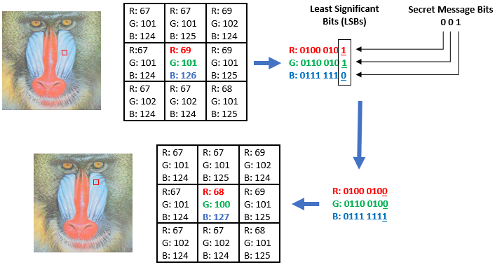

# Steganography

## What is Steganography?
Steganography is the practice of hiding secret information within an ordinary object, such as an image, audio file, video, or text, in a way that prevents detection. Unlike cryptography, which focuses on encrypting messages to obscure their meaning, steganography conceals the *existence* of the message itself.

The word "steganography" is derived from the Greek words *steganos* (meaning "covered" or "hidden") and *graphein* (meaning "to write").

---

## How Steganography Works

Steganography embeds data in such a way that it doesn't alter the noticeable properties of the carrier (like an image or audio file). The most common technique is **Least Significant Bit (LSB) manipulation**, where secret data is encoded in the least important bits of a digital file.

### Example: Least Significant Bit (LSB) Steganography
In digital images, each pixel is usually represented by 8-bit values (e.g., RGB values). The least significant bit can be changed without significantly altering the visual appearance of the image.

#### Example of LSB Encoding:
- Original 8-bit pixel value: `11001100`
- To hide a secret bit (`1`): Change the LSB.
  - Modified pixel value: `11001101`

In this way, even a large image can store a surprising amount of hidden information!

---

## Applications of Steganography
Steganography has a wide range of applications, including:
- **Data Security**: Hiding confidential information in files.
- **Digital Watermarking**: Embedding watermarks in images, videos, or audio to prove ownership.
- **Covert Communication**: Sending secret messages without raising suspicion.
- **Intellectual Property Protection**: Preventing unauthorized duplication of digital content.

---

## Types of Steganography
There are several types of steganography based on the medium used:

1. **Image Steganography**  
   Hiding data inside images by manipulating pixel values, typically using LSB techniques.

2. **Audio Steganography**  
   Concealing information in audio files by modifying frequency, phase, or amplitude.

3. **Video Steganography**  
   Embedding data within frames of a video file.

4. **Text Steganography**  
   Using methods like word spacing, font manipulation, or invisible characters to hide data in text.

---

## Advantages and Limitations

### Advantages:
- **Undetectable to the naked eye**: Properly implemented steganography can be difficult to detect.
- **Can complement encryption**: Steganography can add an additional layer of security by hiding the encrypted message.

### Limitations:
- **Limited storage**: Steganography methods can store only small amounts of data.
- **Vulnerable to detection by advanced tools**: Steganalysis tools can sometimes reveal hidden data.
- **Quality loss**: If not carefully implemented, embedding data may degrade the carrier (e.g., image or audio).

